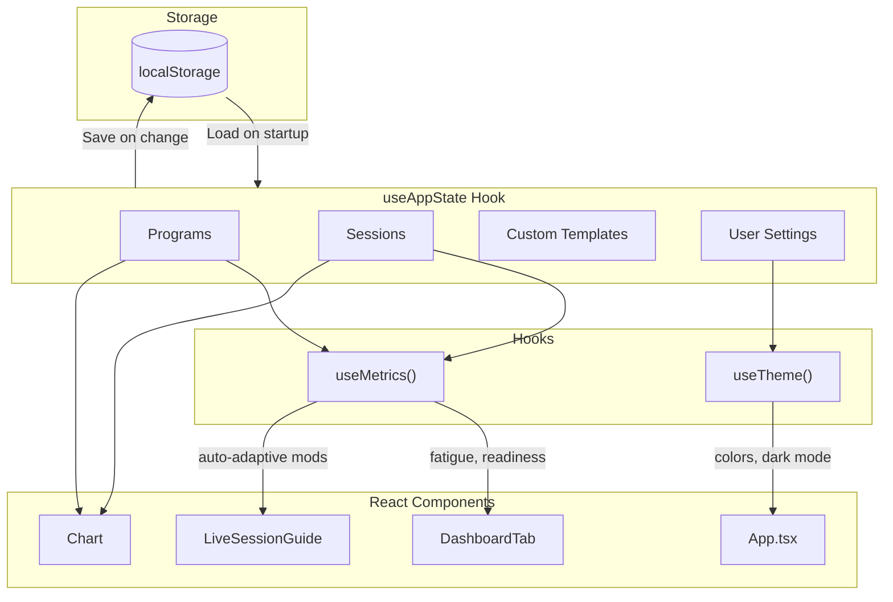

# CardioKinetic Architecture

> A comprehensive guide to understanding the CardioKinetic codebase.

---

## Overview

CardioKinetic is a training management app built with:
- **React 19** - UI framework
- **TypeScript** - Type-safe JavaScript
- **Vite** - Build tool
- **Capacitor** - Android native bridge
- **Tailwind CSS** - Styling

The app helps users plan, execute, and track cardiovascular training programs with features like guided sessions, fatigue monitoring, and auto-adaptive adjustments.

---

## Directory Structure

```
cardiokinetic/
├── App.tsx                 # Main app component (orchestration)
├── index.tsx               # React entry point
├── index.html              # HTML template
├── types.ts                # Core TypeScript types
├── presets.ts              # Program presets & default templates
├── programTemplate.ts      # Template system types
├── config.ts               # App configuration (version, API URLs)
│
├── components/             # React UI components
│   ├── Chart.tsx           # Analytics chart
│   ├── DashboardTab.tsx    # Home dashboard
│   ├── SettingsTab.tsx     # Settings screen
│   ├── ProgramTab.tsx      # Program management
│   ├── LiveSessionGuide.tsx # Guided workout screen
│   ├── SessionLog.tsx      # Manual session logging
│   ├── Onboarding.tsx      # First-run setup
│   ├── modals/             # Modal dialogs (inc. SessionChartModal for chart viewing)
│   ├── settings/           # Settings sub-screens
│   ├── liveSession/        # Live session sub-components (RPE slider, phase controls)
│   └── devtools/           # Developer tools (accessible via Settings → Dev Tools)
│
├── hooks/                  # Custom React hooks
│   ├── useAppState.ts      # Global app state & persistence
│   ├── useMetrics.ts       # Fatigue/readiness calculations
│   ├── useTheme.ts         # Dark mode & accent colors
│   ├── useSessionTimer.ts  # Live session countdown logic
│   └── useNavigationState.ts # Tab & modal navigation
│
├── utils/                  # Pure utility functions
│   ├── metricsUtils.ts     # Load, fatigue, readiness math
│   ├── dateUtils.ts        # Timezone-agnostic date handling
│   ├── templateUtils.ts    # Plan generation from templates
│   ├── exportUtils.ts      # Backup/restore functionality
│   ├── questionnaireConfig.ts # Daily readiness questionnaire
│   ├── autoAdaptive*.ts    # Auto-adaptive modifier system
│   └── foregroundService.ts # Android notification service
│
└── android/                # Capacitor Android project
    └── app/
        ├── build.gradle    # Android build config
        └── src/main/       # Android native code
```

---

## Data Flow



---

## Core Concepts

### Programs & Sessions

- **ProgramRecord**: A user's active training plan
  - Contains a generated `PlanWeek[]` (weekly targets)
  - Linked to a `ProgramPreset` (template)
  - Has a status: `active`, `completed`, or `archived`

- **Session**: A single workout entry
  - Records: date, duration, power, RPE, work/rest ratio
  - Guided sessions store `chartData` (power/RPE history for post-session visualization)
  - Linked to a program via `programId`

### Metrics Engine

The fatigue/readiness system uses **EWMA (Exponentially Weighted Moving Average)**:

```
ATL (Acute Training Load)   = 7-day weighted average
CTL (Chronic Training Load) = 42-day weighted average
TSB (Training Stress Balance) = CTL - ATL

Fatigue Score  = ACWR sigmoid function (injury risk)
Readiness Score = TSB gaussian function (performance state)
```

### Questionnaire System

Daily readiness questionnaires adjust fatigue/readiness with **carryover effects**:

- **Same-day adjustment**: Direct impact from questionnaire responses
- **Wellness modifier**: 3-day EWMA that carries effects forward
- **Trend analysis**: Uses last 7 days to amplify/dampen adjustments

```
Day with questionnaire: Apply full adjustment + update wellness modifier
Day without: Apply decayed wellness modifier from previous days
```

Both `useMetrics` (dashboard) and `Chart.tsx` use identical carryover logic.

### Auto-Adaptive System

Uses Monte Carlo simulation to generate percentiles for each week of a program:
1. Simulates 100,000 random training scenarios
2. Calculates P15/P25/P35/P65/P75/P85 percentiles for fatigue & readiness
3. Compares real-time metrics to percentiles
4. Adjusts session parameters when outside normal zones

---

## State Management

### useAppState Hook

Central hook managing all persistent state:

| State | Storage Key | Description |
|-------|-------------|-------------|
| `programs` | `ck_programs` | All program records |
| `sessions` | `ck_sessions` | All logged workouts |
| `customTemplates` | `ck_custom_templates` | User-created templates |
| `accentColor` | `ck_accent_color` | UI accent color |
| `questionnaireResponses` | `ck_questionnaire_responses` | Daily check-in data |

### Data Persistence

All data persists to `localStorage` via automatic save effects:
```typescript
useEffect(() => {
    localStorage.setItem('ck_programs', JSON.stringify(programs));
}, [programs]);
```

Backups can be exported/imported as JSON files via `exportUtils.ts`.

---

## Mobile Integration (Capacitor)

### Android Features

| Feature | Implementation |
|---------|----------------|
| **Back Button** | `@capacitor/app` - Custom back navigation hierarchy |
| **Foreground Service** | `@capawesome-team/capacitor-android-foreground-service` - Persistent session notification |
| **Haptic Feedback** | `@capacitor/haptics` - Vibration on phase changes |
| **Local Notifications** | `@capacitor/local-notifications` - Session alerts |

### Building for Android

```bash
npm run build         # Build web app
npx cap sync android  # Sync to Android project
cd android && ./gradlew assembleDebug  # Build APK
```

---

## Testing

### Test Structure

Tests are co-located with source files:
```
utils/
├── metricsUtils.ts
├── metricsUtils.test.ts    # Unit tests next to source
```

### Running Tests

```bash
npm test           # Watch mode
npm run test:run   # Single run (CI)
```

### Coverage

- **889+ unit tests** covering:
  - Utility functions (Date, metrics, validation)
  - Algorithm implementations (questionnaire, modifiers)
  - Component rendering

---

## Key Design Decisions

### 1. LocalStorage over Database
- **Why**: Simple, no backend needed, works offline
- **Trade-off**: Limited to ~5MB, single-device only

### 2. Template-Based Program Generation
- **Why**: Allows dynamic week counts with consistent progression
- **How**: Templates define phases with interpolated weeks

### 3. Timezone-Agnostic Dates
- **Why**: Avoid bugs when users travel or change timezones
- **How**: Store dates as `YYYY-MM-DD` strings, calculate day indices

### 4. Monolithic App.tsx (Current)
- **Why**: Rapid initial development
- **Trade-off**: 950+ lines, should be refactored (in progress)

---

## File Reference

| File | Purpose | Size |
|------|---------|------|
| `App.tsx` | Main orchestration, navigation, handlers | 950 lines |
| `useAppState.ts` | Global state & persistence | 400 lines |
| `useSessionTimer.ts` | Live session logic | 1000 lines |
| `presets.ts` | Default program templates | 890 lines |
| `questionnaireConfig.ts` | Readiness algorithm | 730 lines |

---

## Contributing

### Code Style

- **TypeScript**: Strict mode, avoid `any`
- **Components**: Functional with hooks
- **Naming**: PascalCase components, camelCase functions

### Adding a New Feature

1. Create component in `/components`
2. Add types to `types.ts` if needed
3. Add state to `useAppState.ts` if persistent
4. Write tests alongside implementation
5. Update `UNCOMMITTED_CHANGES.md`

---

## Glossary

| Term | Definition |
|------|------------|
| **ACWR** | Acute:Chronic Workload Ratio - injury risk metric |
| **TSB** | Training Stress Balance - readiness indicator |
| **RPE** | Rate of Perceived Exertion (1-10 scale). Descriptions defined in `components/modals/sessionSetupUtils.ts` (single source of truth, supports 0.5 increments) |
| **ATL** | Acute Training Load - recent stress |
| **CTL** | Chronic Training Load - fitness level |
