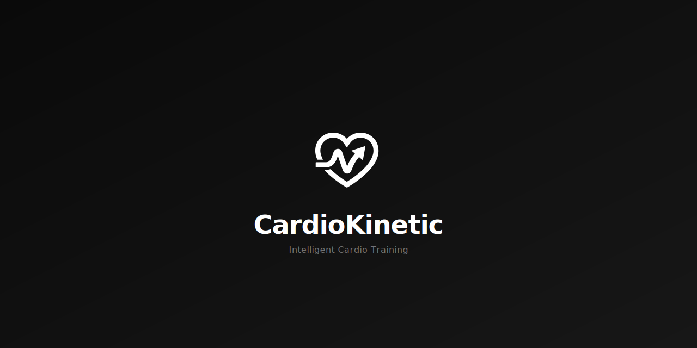
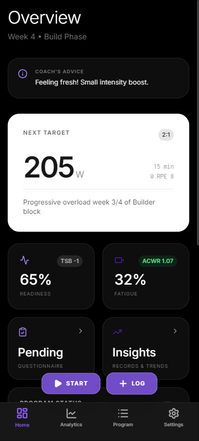
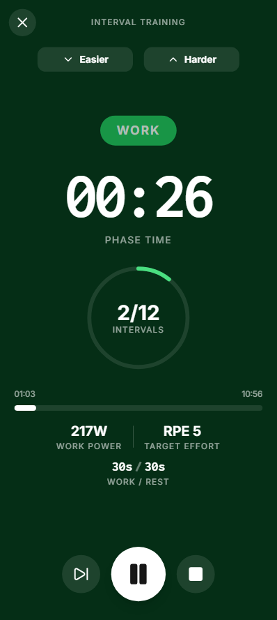
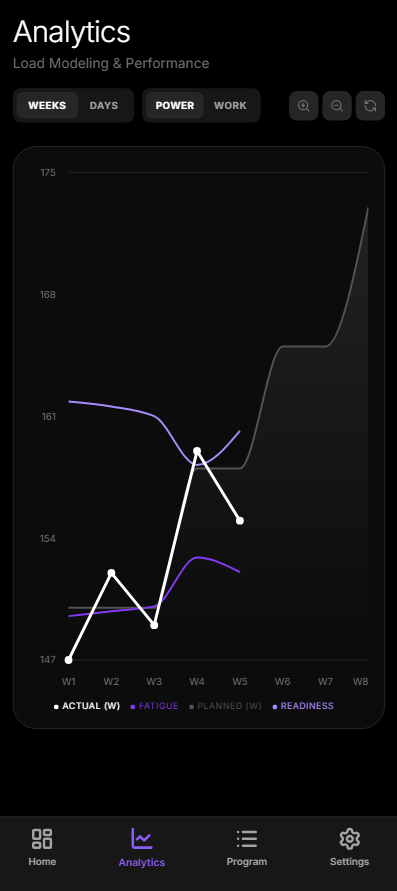
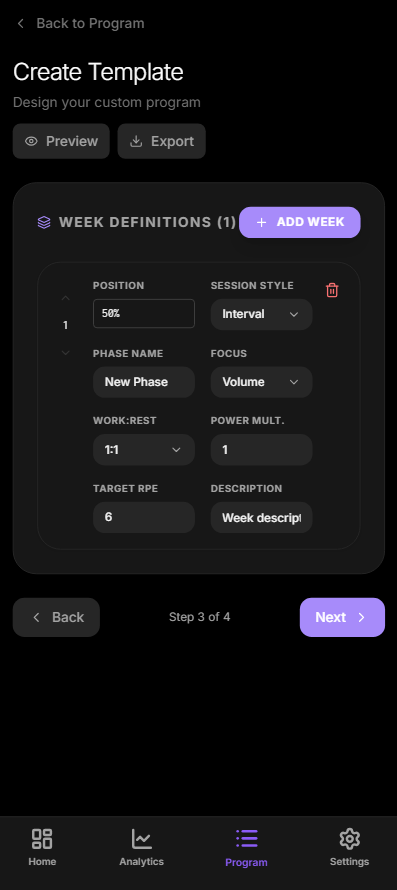
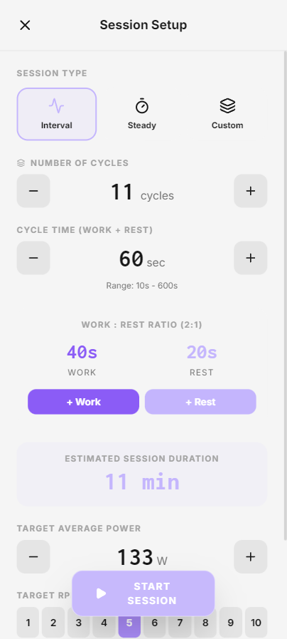
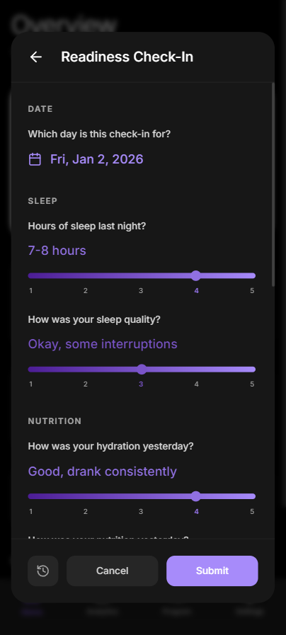

<div align="center">
  
</div>

<div align="center">

[](https://react.dev)
[](https://www.typescriptlang.org)
[](https://capacitorjs.com)
[](https://www.gnu.org/licenses/gpl-3.0)

[](https://github.com/TchelloSimis/CardioKinetic/releases/latest/download/CardioKinetic.apk)

**Intelligent cardio training with adaptive programs, real-time fatigue tracking, and personalized coaching.**

[Download](#download) • [Features](#features) • [Screenshots](#screenshots) • [How It Works](#how-it-works) • [Getting Started](#getting-started) • [Template Documentation](TEMPLATE_DOCUMENTATION.md)

</div>

---

## Download

**[Download APK (v1.5.4)](https://github.com/TchelloSimis/CardioKinetic/releases/latest/download/CardioKinetic.apk)** — Install directly on your Android device.

> To install, enable "Install from unknown sources" in your Android settings when prompted.

---

## Features

### Smart Training Programs

Build structured periodized training programs with intelligent progression. CardioKinetic supports three progression modes:

- **Power Progression** — Increase power output week-over-week while maintaining session duration
- **Duration Progression** — Extend session length progressively while keeping power constant  
- **Double Progression** — Independently control both power and duration each week

Programs can be **fixed-length** (e.g., exactly 8 weeks) or **variable-length** (e.g., 4-12 weeks), automatically interpolating training phases to fit your schedule.

### Block-Based Programs

For advanced periodization, CardioKinetic supports **block-based program structures** that enable sophisticated training cycles:

- **Reusable Training Blocks** — Define blocks like "Builder", "Intensity", or "Deload" with specific week counts and power progressions
- **Block Chaining** — Automatically sequence blocks (e.g., Builder → Deload → Builder) for optimal periodization
- **Power Reference Modes** — Calculate power relative to base, previous week, or block start for compound progressions
- **Fixed Intro/Outro Weeks** — Define specific first and last weeks that remain constant regardless of program length

### Daily Readiness Questionnaire

Fine-tune your training with a daily wellness check-in that adjusts fatigue and readiness scores based on your subjective state:

- **8 Wellness Questions** — Covering sleep, nutrition, stress, physical state, and motivation
- **Contradiction-Weighted Adjustments** — Responses that contradict predicted metrics receive larger score modifications
- **Asymmetric Safety Bias** — Feeling worse than expected carries greater weight than feeling better, prioritizing injury prevention
- **Optional and Editable** — Complete when you want, skip with no penalty, and edit previous responses anytime

### Auto-Adaptive Modifier System

The new heart of CardioKinetic's training intelligence:

- **Monte Carlo Analysis** — Runs 100k simulations to determine your optimal training zones
- **6-State Adaptation** — Automatically identifies if you are Critical, Stressed, Tired, Baseline, Fresh, or Primed
- **Smart Session Adjustments** — Intelligently modifies interval sets, rest periods, and steady-state duration based on your state
- **Coach Priority** — Respects manual overrides while keeping your training safe and effective

### Comprehensive Analytics

Track every session and visualize your progress with detailed analytics:

- **Power Trends** — See your average power output over time with planned vs. actual comparisons
- **Total Work** — Track cumulative training volume (kilojoules) per session
- **Fatigue & Readiness Scores** — Real-time physiological state estimation based on training load
- **Session History** — Complete log of all sessions with RPE, duration, and performance metrics
- **Edit & Delete Sessions** — Full control over your training history

### Training Insights

Get a comprehensive view of your training status with the dedicated Insights page:

- **Body Status Overview** — Current readiness and fatigue percentages with weekly averages and trend indicators
- **Personalized Recommendations** — Smart insights suggesting when to push harder or take it easy
- **Personal Records** — Track your peak power, longest session, and most work completed
- **Weekly Trends** — Compare current week vs. previous week training metrics

### Adaptive Fatigue System

CardioKinetic uses an evidence-based **Fitness-Fatigue model** (Banister model) combined with advanced scoring algorithms:

| Metric | Description |
|--------|-------------|
| **ATL** (Acute Training Load) | 7-day exponentially weighted average — represents short-term fatigue |
| **CTL** (Chronic Training Load) | 42-day exponentially weighted average — represents long-term fitness |
| **ACWR** (Acute:Chronic Ratio) | ATL / CTL — values >1.5 indicate elevated injury risk |
| **TSB** (Training Stress Balance) | CTL minus ATL — positive means fresh, negative means fatigued |

**Fatigue Score** uses the ACWR with a Logistic Sigmoid: `100 / (1 + e^(-4.5 × (ACWR - 1.15)))`
- Sensitive to training load variations (ACWR > 1.15 = elevated load zone)

**Readiness Score** uses TSB with a Gaussian distribution: `100 × e^(-(TSB - 20)² / 1250)`
- Peaks at TSB +20 (optimal freshness)
- Penalizes both deep fatigue AND excessive rest (detraining)

**Fatigue Modifiers** can automatically adjust your training based on these scores — reducing intensity when you're tired or pushing harder when you're fresh.

### Flexible Session Types

#### Interval Training
Customizable high-intensity interval sessions with:
- Configurable **work/rest ratios** (1:3, 1:2, 1:1, 2:1, etc.)
- Adjustable **cycle time** with +5s/-5s fine-tuning
- **Audio cues** for interval transitions and countdowns
- Real-time power targets and RPE guidance

#### Steady-State Endurance
Zone 2 aerobic training with:
- Continuous power targets (no intervals)
- Duration-based progression
- Perfect for building aerobic base and fat oxidation

#### Custom Sessions
Mix and match training blocks in a single session:
- Combine **warm-up** (steady-state) → **main set** (intervals) → **cooldown** (steady-state)
- Each block has independent power targets and durations
- Define sessions with explicit cycles, work/rest durations per block

### Personalized Experience

- **Material You Theming** — On Android, automatically adapts accent colors from your wallpaper
- **Light & Dark Mode** — System-aware or manual toggle
- **Multiple Accent Colors** — Choose from Lavender, Rose, Sage, Ocean, Sunset, Monochrome, or create your own
- **Custom Accent Controls** — Fine-tune saturation, brightness, and hue to match your style
- **Monospace Numbers** — Clean, readable numeric displays with Inconsolata font
- **Full Backup & Restore** — Export all your data (programs, sessions, settings) and import on any device

### Native Android Experience

Built with Capacitor for a true native feel:
- **Foreground Service** — Sessions continue running when the app is in the background
- **Persistent Notification** — Control playback (pause/resume/end) from the notification shade
- **Hardware Back Button** — Proper handling with confirmation dialogs during sessions
- **Reliable Audio Cues** — Interval transitions and countdowns work even when screen is off
- **Haptic Feedback** — Tactile responses for key interactions
- **PWA Support** — Install from browser with offline capability

---

## Screenshots

<div align="center">

| Dashboard | Live Session | Analytics |
|:---:|:---:|:---:|
|  |  |  |

| Program Editor | Session Setup | Daily Check-In |
|:---:|:---:|:---:|
|  |  |  |

</div>

---

## How It Works

### 1. Create or Select a Program

Choose from built-in presets or create your own program with:
- **Phase definitions** (Foundation, Build, Peak, Taper)
- **Week-by-week configuration** with power multipliers and target RPE
- **Training focus** per week (Volume, Density, Intensity, Recovery)
- **Block-based structures** for advanced periodization

### 2. Complete Your Daily Check-In

Each day, optionally complete a quick wellness questionnaire:
- Answer questions about sleep, nutrition, stress, and how you feel
- Your fatigue and readiness scores adjust based on your responses
- Skip any day without penalty — the system adapts to available data

### 3. Configure Your Session

Before each workout, fine-tune:
- **Session duration** 
- **Work/rest intervals** and cycle count
- **Target power** (percentage of your base power)
- **Session style** (interval, steady-state, or custom blocks)

### 4. Train with Real-Time Guidance

During your session:
- Large, readable **power targets** and **elapsed time**
- **Interval countdowns** with audio cues
- **Live work-to-rest visualization**
- **Harder/Easier adjustments** with ±5W fine-tuning
- Pause/resume without losing progress

### 5. Log and Track Progress

After each session:
- Rate your **perceived exertion (RPE)**
- Session is automatically saved with all metrics
- **Fatigue and readiness scores update** based on your training load
- View trends and plan recovery

### 6. Adaptive Adjustments

If you define fatigue modifiers in your program:
- Training automatically adjusts when you're tired
- Power targets reduce, rest periods extend
- Coach's advice messages guide you through adjustments
- Use **Suggest Modifiers** to automatically generate optimal adjustments for your program

---

## Getting Started

### Prerequisites

- [Node.js](https://nodejs.org/) v18 or higher
- For Android builds: [Android Studio](https://developer.android.com/studio) with SDK 34+

### Installation

```bash
# Clone the repository
git clone https://github.com/TchelloSimis/CardioKinetic.git
cd CardioKinetic

# Install dependencies
npm install

# Run in development mode (opens in browser)
npm run dev
```

### Android Build

```bash
# Build the web app
npm run build

# Sync with Capacitor
npx cap sync android

# Open in Android Studio
npx cap open android
```

From Android Studio, click **Run** to deploy to your device or emulator.

---

## Program Templates

CardioKinetic's template system lets you create sophisticated, shareable training programs as JSON files.

### Key Capabilities

| Feature | Description |
|---------|-------------|
| **Variable Length** | Programs that scale from 4 to 12+ weeks with automatic interpolation |
| **Block-Based Structure** | Define reusable training blocks with power references and chaining |
| **Percentage Positions** | Define weeks at "first", "50%", "last" for flexible scaling |
| **Fatigue Modifiers** | Automatic adjustments based on ATL, CTL, and readiness thresholds |
| **Intelligent Suggestions** | Auto-generate modifiers using signal processing and Monte Carlo simulation |
| **Custom Blocks** | Mix steady-state and interval blocks in hybrid sessions |
| **Expression Syntax** | Dynamic power/duration using expressions like `"power * 0.8"` |

### Quick Example

```json
{
  "name": "8-Week HIIT Accelerator",
  "weekConfig": { "type": "fixed", "fixed": 8 },
  "defaultSessionStyle": "interval",
  "progressionMode": "power",
  "weeks": [
    { "position": "first", "phaseName": "Foundation", "powerMultiplier": 0.9, "targetRPE": 6 },
    { "position": "50%", "phaseName": "Build", "powerMultiplier": 1.05, "targetRPE": 7 },
    { "position": "last", "phaseName": "Peak", "powerMultiplier": 1.15, "targetRPE": 9 }
  ],
  "fatigueModifiers": [
    { 
      "condition": { "fatigue": ">80", "logic": "and" },
      "adjustments": { "powerMultiplier": 0.85, "message": "High fatigue - reducing intensity" }
    }
  ]
}
```

**[Full Template Documentation →](TEMPLATE_DOCUMENTATION.md)**

---

## Tech Stack

| Layer | Technology |
|-------|------------|
| **UI Framework** | React 19 |
| **Language** | TypeScript 5 |
| **Styling** | Tailwind CSS |
| **Charts** | Recharts |
| **Icons** | Lucide React |
| **Mobile** | Capacitor 6 (Android) |
| **State** | React Hooks + LocalStorage |
| **Fonts** | Inter (UI) + Inconsolata (numbers) |
| **Testing** | Vitest + Testing Library |

---

## License

This project is licensed under the **GNU General Public License v3.0**.

See the [LICENSE](LICENSE) file for details.


---

<div align="center">

Made for athletes who want smarter training

**[Report Bug](https://github.com/TchelloSimis/CardioKinetic/issues)** • **[Request Feature](https://github.com/TchelloSimis/CardioKinetic/issues)**

</div>
