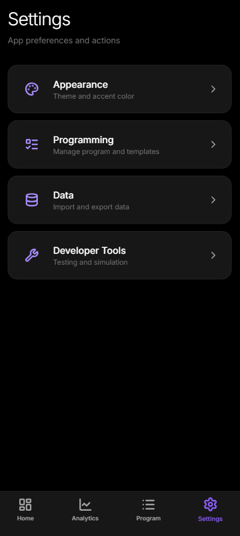

<div align="center">
  
</div>

<div align="center">

[](https://react.dev)
[](https://www.typescriptlang.org)
[](https://capacitorjs.com)
[](https://creativecommons.org/licenses/by-nc/4.0/)

[](https://github.com/TchelloSimis/CardioKinetic/releases/latest/download/app-debug.apk)

**Intelligent cardio training with adaptive programs, real-time fatigue tracking, and personalized coaching.**

[Download](#download) • [Features](#features) • [Screenshots](#screenshots) • [How It Works](#how-it-works) • [Getting Started](#getting-started) • [Template Documentation](TEMPLATE_DOCUMENTATION.md)

</div>

---

## Download

**[Download APK (v1.0.0)](https://github.com/TchelloSimis/CardioKinetic/releases/latest/download/app-debug.apk)** — Install directly on your Android device.

> To install, enable "Install from unknown sources" in your Android settings when prompted.

---

## Features

### Smart Training Programs

Build structured periodized training programs with intelligent progression. CardioKinetic supports three progression modes:

- **Power Progression** — Increase power output week-over-week while maintaining session duration
- **Duration Progression** — Extend session length progressively while keeping power constant  
- **Double Progression** — Independently control both power and duration each week

Programs can be **fixed-length** (e.g., exactly 8 weeks) or **variable-length** (e.g., 4-12 weeks), automatically interpolating training phases to fit your schedule.

### Comprehensive Analytics

Track every session and visualize your progress with detailed analytics:

- **Power Trends** — See your average power output over time with planned vs. actual comparisons
- **Total Work** — Track cumulative training volume (kilojoules) per session
- **Fatigue & Readiness Scores** — Real-time physiological state estimation based on training load
- **Session History** — Complete log of all sessions with RPE, duration, and performance metrics

### Adaptive Fatigue System

CardioKinetic uses an evidence-based **Fitness-Fatigue model** (Banister model) to track your training state:

| Metric | Description |
|--------|-------------|
| **ATL** (Acute Training Load) | 7-day exponentially weighted average — represents short-term fatigue |
| **CTL** (Chronic Training Load) | 42-day exponentially weighted average — represents long-term fitness |
| **TSB** (Training Stress Balance) | CTL minus ATL — positive means fresh, negative means fatigued |

The system calculates daily training load using: `Load = RPE^1.5 × Duration^0.75 × PowerRatio^0.5`

This reflects the physiological reality that high-intensity sessions cause disproportionately more fatigue, and that working above your recent average is more stressful.

**Fatigue Modifiers** can automatically adjust your training based on these scores — reducing intensity when you're tired or pushing harder when you're fresh.

### Flexible Session Types

#### Interval Training
Customizable high-intensity interval sessions with:
- Configurable **work/rest ratios** (1:3, 1:2, 1:1, 2:1, etc.)
- Adjustable **cycle time** with +5s/-5s fine-tuning
- **Audio cues** for interval transitions and countdowns
- Real-time power targets and RPE guidance

#### Steady-State Endurance
Zone 2 aerobic training with:
- Continuous power targets (no intervals)
- Duration-based progression
- Perfect for building aerobic base and fat oxidation

#### Custom Sessions
Mix and match training blocks in a single session:
- Combine **warm-up** (steady-state) → **main set** (intervals) → **cooldown** (steady-state)
- Each block has independent power targets and durations
- Define sessions with explicit cycles, work/rest durations per block

### Personalized Experience

- **Material You Theming** — On Android, automatically adapts accent colors from your wallpaper
- **Light & Dark Mode** — System-aware or manual toggle
- **Custom Accent Colors** — Choose your own accent with saturation/brightness controls
- **Monospace Numbers** — Clean, readable numeric displays with Inconsolata font

### Native Android Experience

Built with Capacitor for a true native feel:
- **Foreground Service** — Sessions continue running when the app is in the background
- **Persistent Notification** — Control playback (pause/resume/end) from the notification shade
- **Hardware Back Button** — Proper handling with confirmation dialogs during sessions
- **Reliable Audio Cues** — Interval transitions and countdowns work even when screen is off

---

## Screenshots

<div align="center">

| Home | Live Session | Analytics |
|:---:|:---:|:---:|
|  |  |  |

| Program Editor | Session Setup | Settings |
|:---:|:---:|:---:|
|  |  |  |

</div>

---

## How It Works

### 1. Create or Select a Program

Choose from built-in presets or create your own program with:
- **Phase definitions** (Foundation, Build, Peak, Taper)
- **Week-by-week configuration** with power multipliers and target RPE
- **Training focus** per week (Volume, Density, Intensity, Recovery)

### 2. Configure Your Session

Before each workout, fine-tune:
- **Session duration** 
- **Work/rest intervals** and cycle count
- **Target power** (percentage of your base power)
- **Session style** (interval, steady-state, or custom blocks)

### 3. Train with Real-Time Guidance

During your session:
- Large, readable **power targets** and **elapsed time**
- **Interval countdowns** with audio cues
- **Live work-to-rest visualization**
- Pause/resume without losing progress

### 4. Log and Track Progress

After each session:
- Rate your **perceived exertion (RPE)**
- Session is automatically saved with all metrics
- **Fatigue and readiness scores update** based on your training load
- View trends and plan recovery

### 5. Adaptive Adjustments

If you define fatigue modifiers in your program:
- Training automatically adjusts when you're tired
- Power targets reduce, rest periods extend
- Coach's advice messages guide you through adjustments

---

## Getting Started

### Prerequisites

- [Node.js](https://nodejs.org/) v18 or higher
- For Android builds: [Android Studio](https://developer.android.com/studio) with SDK 34+

### Installation

```bash
# Clone the repository
git clone https://github.com/TchelloSimis/CardioKinetic.git
cd CardioKinetic

# Install dependencies
npm install

# Run in development mode (opens in browser)
npm run dev
```

### Android Build

```bash
# Build the web app
npm run build

# Sync with Capacitor
npx cap sync android

# Open in Android Studio
npx cap open android
```

From Android Studio, click **Run** to deploy to your device or emulator.

---

## Program Templates

CardioKinetic's template system lets you create sophisticated, shareable training programs as JSON files.

### Key Capabilities

| Feature | Description |
|---------|-------------|
| **Variable Length** | Programs that scale from 4 to 12+ weeks with automatic interpolation |
| **Percentage Positions** | Define weeks at "first", "50%", "last" for flexible scaling |
| **Fatigue Modifiers** | Automatic adjustments based on ATL, CTL, and readiness thresholds |
| **Custom Blocks** | Mix steady-state and interval blocks in hybrid sessions |
| **Expression Syntax** | Dynamic power/duration using expressions like `"power * 0.8"` |

### Quick Example

```json
{
  "name": "8-Week HIIT Accelerator",
  "weekConfig": { "type": "fixed", "fixed": 8 },
  "defaultSessionStyle": "interval",
  "progressionMode": "power",
  "weeks": [
    { "position": "first", "phaseName": "Foundation", "powerMultiplier": 0.9, "targetRPE": 6 },
    { "position": "50%", "phaseName": "Build", "powerMultiplier": 1.05, "targetRPE": 7 },
    { "position": "last", "phaseName": "Peak", "powerMultiplier": 1.15, "targetRPE": 9 }
  ],
  "fatigueModifiers": [
    { 
      "condition": { "fatigue": ">80", "logic": "and" },
      "adjustments": { "powerMultiplier": 0.85, "message": "High fatigue - reducing intensity" }
    }
  ]
}
```

**[Full Template Documentation →](TEMPLATE_DOCUMENTATION.md)**

---

## Tech Stack

| Layer | Technology |
|-------|------------|
| **UI Framework** | React 19 |
| **Language** | TypeScript 5 |
| **Styling** | Tailwind CSS |
| **Charts** | Recharts |
| **Icons** | Lucide React |
| **Mobile** | Capacitor 6 (Android) |
| **State** | React Hooks + LocalStorage |
| **Fonts** | Inter (UI) + Inconsolata (numbers) |

---

## License

This project is licensed under **CC BY-NC 4.0** (Creative Commons Attribution-NonCommercial 4.0).

You are free to:
- Use, copy, and modify the code
- Share and redistribute
- Build upon this work

Under these conditions:
- **Attribution** — You must give appropriate credit
- **NonCommercial** — You may not use this for commercial purposes

See the [LICENSE](LICENSE) file for details.

---

<div align="center">

Made for athletes who want smarter training

**[Report Bug](https://github.com/TchelloSimis/CardioKinetic/issues)** • **[Request Feature](https://github.com/TchelloSimis/CardioKinetic/issues)**

</div>
